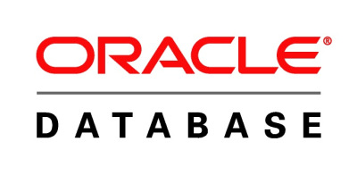

# Docker安装oracle11g #

## 服务简介 ##

* * *

ORACLE数据库系统是美国ORACLE公司（甲骨文）提供的以分布式数据库为核心的一组软件产品，是目前最流行的客户/服务器(CLIENT/SERVER)或B/S体系结构的数据库之一。

Oracle从10的企业级版本开始就不在对Mac进行相关技术支持和运维服务,采用docker的方式安装orcal

 
 
[oracle11g GitHub](https://github.com/gcusnieux/docker-oracle11g/onlyoffice-owncloud)

## 准备镜像 ##

    docker pull deepdiver/docker-oracle-xe-11g

## 运行容器 ##

    docker run -d -p 1521:1521 --name oracle11g deepdiver/docker-oracle-xe-11g

## 常见说明 ##