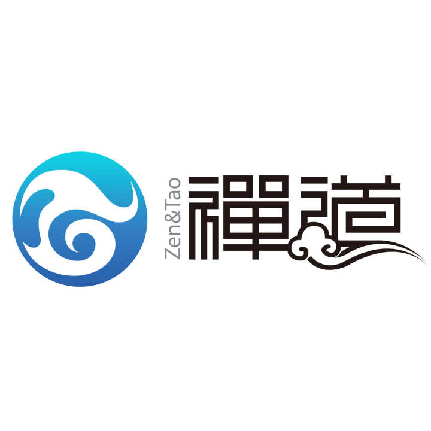

# **Docker安装Zentao** #
## 服务简介 ##

* * *
禅道项目管理软件（ZenTaoPMS）是一款国产的，基于ZPL协议，开源免费的项目管理软件，它集产品管理、项目管理、测试管理于一体，同时还包含了事务管理、组织管理等诸多功能。

 
 
[ GitHub ](https://github.com/easysoft/zentaopms)
## 准备镜像 ##
    docker pull idoop/zentao
## 运行容器 ##
#### 参数说明 ####